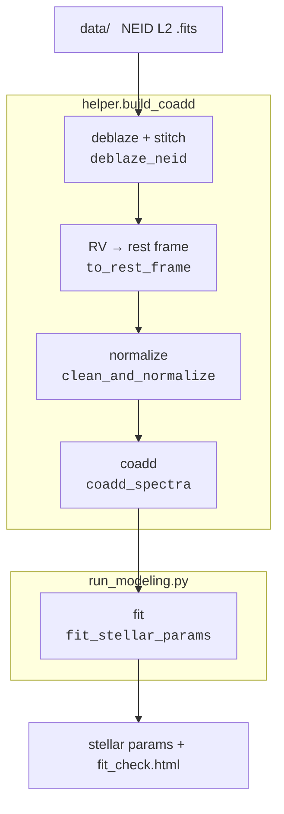

### Modeling NEID Spectra Using iSpec

 

```mermaid
flowchart TD
    A[data/ &nbsp; NEID L2 .fits] --> B[deblaze + stitch<br/><code>deblaze_neid</code>]
    subgraph BC[helper.build_coadd]
      B --> C[RV &rarr; rest frame<br/><code>to_rest_frame</code>]
      C --> D[normalize<br/><code>clean_and_normalize</code>]
      D --> E[coadd<br/><code>coadd_spectra</code>]
    end
    subgraph RM[run_modeling.py]
      E --> F[fit<br/><code>fit_stellar_params</code>]
    end
    F --> G[stellar params + fit_check.html]
```
