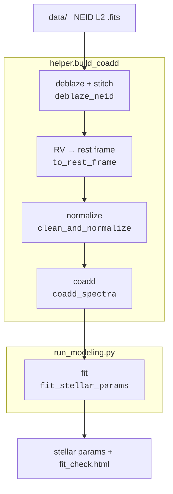

### Modeling NEID Spectra Using iSpec

[](https://deepwiki.com/wangxianyu7/NEID_iSpec) [](https://colab.research.google.com/drive/1TqQ3rogcBWYfo9g498yV6lIOolczGBcM?usp=sharing)

Measure stellar parameters (Teff, log g, [Fe/H], v_mic, v sin i) from coadded NEID L2 spectra by synthetic spectral fitting with [iSpec](https://www.blancocuaresma.com/s/iSpec) (see Section 4.1 of our [single-star warm Jupiter alignment tendency paper](https://ui.adsabs.harvard.edu/abs/2024ApJ...973L..21W/abstract)). Two files: `helper.py` (all functions) and `run_modeling.py` (entry point + config).

##### How to use it

1. Install iSpec (see the [manual](https://www.blancocuaresma.com/s/iSpec/manual/installation) or the Colab tutorial).
2. Put NEID L2 `*.fits` files into `data/`, then run:

```
python run_modeling.py
```

`run_modeling.py` builds the coadd (if `output/coadd_norm.txt` is missing) and then fits it. iSpec is located automatically via `helper.resolve_ispec_dir()` (checks `$ISPEC_DIR`, then common paths); set `ISPEC_DIR` or pass `extra_candidates=[...]` if it isn't found.

Outputs (in `output/`):

- `stellar_params.txt` — best-fit parameters + convergence status
- `fit_check.html` — interactive (zoomable) observed vs. best-fit model + residuals, with fit regions shaded
- `coadd_norm.txt`, `coadd_used.txt`, `bestfit_model.txt` — spectra
- `deblaze_check.png`, `normalize_check.png`, `coadd_check.png` — pre-processing diagnostics

##### Pipeline



##### Technical Details

1. **Deblaze** each order with the SCI blaze profile (`SCIFLUX / SCIBLAZE`; errors from `SCIVAR`).
2. **Trim + stitch**: drop the low-SNR order edges (central-window trim, orders 45–82), correct the known 77/78 flux offset in the overlap, and join into one spectrum. Wavelengths are converted vacuum → air.
3. **Rest frame**: shift to the stellar rest frame analytically from the L2 header (`SSBZ100` barycentric redshift, `QRV` systemic RV) — no cross-correlation.
4. **Continuum normalization**: fit the continuum against a synthetic **template chosen a priori from the header `QTEFF`** (fixed rough log g / [Fe/H] / v sin i) — like picking a CCF mask by spectral type. This divides out the line blanketing so the continuum does not sink into crowded line forests. `'splines'` is a model-independent fallback. Cosmic rays are removed first.
5. **Coadd**: resample each exposure onto a common grid (iSpec) and combine with an inverse-variance weighted mean.
6. **Fit** with `ispec.model_spectrum` — radiative transfer SPECTRUM (Gray 1994) + MARCS.GES atmospheres + GES v6 line list + Grevesse 2007 abundances, synthesized on the fly. Fit regions (`segments_feh_Halpha_Hbeta_MgI.txt`) are the wings of Hα, Hβ and the Mg I triplet (Teff, log g) plus Fe I / Fe II lines ([Fe/H], v sin i). Initial guess is solar except **Teff = QTEFF**.
   - **Free**: Teff, log g, [M/H], [α/Fe], v_mic, v sin i
   - **Tied** (empirical relation, recomputed each iteration): v_mac via Doyle 2014 — fixing it is what lets v sin i be measured for fast rotators
   - **Fixed**: R = 110000, limb-darkening coeff = 0.6, v_rad = 0

##### Notes

- `data/neidL2_*.fits` here are **slimmed example files** — only the 4 extensions the pipeline uses (`SCIFLUX`/`SCIVAR`/`SCIWAVE`/`SCIBLAZE`). Full L2 files are on the NEID archive.

##### Citations
If you use this code, citing the works below is appreciated.

```
%This pipeline; see Section 4.1
@ARTICLE{WangXY2024WJAlignment,
       author = {{Wang}, Xian-Yu and {Rice}, Malena and {Wang}, Songhu and {Kanodia}, Shubham and {Dai}, Fei and {Logsdon}, Sarah E. and {Schweiker}, Heidi and {Teske}, Johanna K. and {Butler}, R. Paul and {Crane}, Jeffrey D. and {Shectman}, Stephen and {Quinn}, Samuel N. and {Kostov}, Veselin and {Osborn}, Hugh P. and {Goeke}, Robert F. and {Eastman}, Jason D. and {Shporer}, Avi and {Rapetti}, David and {Collins}, Karen A. and {Watkins}, Cristilyn N. and {Relles}, Howard M. and {Ricker}, George R. and {Seager}, Sara and {Winn}, Joshua N. and {Jenkins}, Jon M.},
        title = "{Single-star Warm-Jupiter Systems Tend to Be Aligned, Even around Hot Stellar Hosts: No T $_{eff}$─{\ensuremath{\lambda}} Dependency}",
      journal = {\apjl},
     keywords = {Planetary alignment, Exoplanet dynamics, Exoplanet evolution, Star-planet interactions, Exoplanets, Planetary theory, Exoplanet systems, Exoplanet astronomy, Planetary dynamics, Hot Jupiters, 1243, 490, 491, 2177, 498, 1258, 484, 486, 2173, 753, Astrophysics - Earth and Planetary Astrophysics},
         year = 2024,
        month = sep,
       volume = {973},
       number = {1},
          eid = {L21},
        pages = {L21},
          doi = {10.3847/2041-8213/ad7469},
archivePrefix = {arXiv},
       eprint = {2408.10038},
 primaryClass = {astro-ph.EP},
       adsurl = {https://ui.adsabs.harvard.edu/abs/2024ApJ...973L..21W},
      adsnote = {Provided by the SAO/NASA Astrophysics Data System}
}

%iSpec
@ARTICLE{Blanco2014,
       author = {{Blanco-Cuaresma}, S. and {Soubiran}, C. and {Heiter}, U. and {Jofr{\'e}}, P.},
        title = "{Determining stellar atmospheric parameters and chemical abundances of FGK stars with iSpec}",
      journal = {\aap},
     keywords = {stars: atmospheres, stars: abundances, methods: data analysis, Astrophysics - Instrumentation and Methods for Astrophysics, Astrophysics - Solar and Stellar Astrophysics},
         year = 2014,
        month = sep,
       volume = {569},
          eid = {A111},
        pages = {A111},
          doi = {10.1051/0004-6361/201423945},
archivePrefix = {arXiv},
       eprint = {1407.2608},
 primaryClass = {astro-ph.IM},
       adsurl = {https://ui.adsabs.harvard.edu/abs/2014A&A...569A.111B},
      adsnote = {Provided by the SAO/NASA Astrophysics Data System}
}
%iSpec
@ARTICLE{Blanco2019,
       author = {{Blanco-Cuaresma}, Sergi},
        title = "{Modern stellar spectroscopy caveats}",
      journal = {\mnras},
     keywords = {techniques: spectroscopic, stars: abundances, stars: atmospheres, stars: fundamental parameters, Astrophysics - Solar and Stellar Astrophysics, Astrophysics - Instrumentation and Methods for Astrophysics},
         year = 2019,
        month = jun,
       volume = {486},
       number = {2},
        pages = {2075-2101},
          doi = {10.1093/mnras/stz549},
archivePrefix = {arXiv},
       eprint = {1902.09558},
 primaryClass = {astro-ph.SR},
       adsurl = {https://ui.adsabs.harvard.edu/abs/2019MNRAS.486.2075B},
      adsnote = {Provided by the SAO/NASA Astrophysics Data System}
}

```